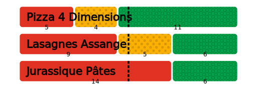
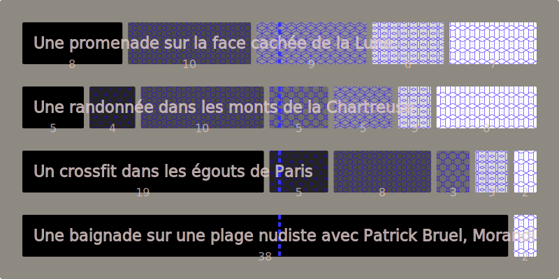

# Merit Profile Generation for Golang

[](LICENSE)
[](https://github.com/MieuxVoter/merit-profile-library-go/releases)
[](https://www.codefactor.io/repository/github/mieuxvoter/merit-profile-library-go)
[](https://goreportcard.com/report/github.com/mieuxvoter/merit-profile-library-go)
[](https://discord.gg/k9YRuZPSZs)

Generate merit profiles (in _SVG_), for use for example in [Majority Judgment] polls.

[Majority Judgment]: https://mieuxvoter.fr

> [!TIP]
> This library focuses on rendering the merit profiles, not ranking the proposals.
> If you want to rank the proposals as well, there is [a library](https://github.com/MieuxVoter/merit-profile-library-go) for that. 




## Usage

```shell
go get github.com/mieuxvoter/merit-profile-library-go
```

```golang
package main

import (
	"fmt"
	"github.com/mieuxvoter/merit-profile-library-go/merit"
)

func main() {
	proposals := []merit.Proposal{
		{
			Name:  "Pizza 4 Dimensions",
			Tally: []uint64{5, 4, 11}, // 3 grades (highest to lowest), 20 judgments
		},
		{
			Name:  "Lasagnes Assange",
			Tally: []uint64{9, 5, 6}, // same
		},
		{
			Name:  "Jurassique Pâtes",
			Tally: []uint64{14, 0, 6}, // same
		},
	}

	svg, err := merit.RenderLinearProfileSVG(
		proposals,
	)
	if err != nil {
		panic(err)
	}

	fmt.Print(svg)
}
```

> [!WARNING]
> Make sure your tallies are:
> - **Consistent**: Their shape must be the same.
> - **Balanced**: Their total must be the same.


## Options

There are options you can pass to `RenderLinearProfileSVG()` to customize the output.

> We use the _functional options pattern_, because it rocks.

Here's an example:

```golang
svg, err := merit.RenderLinearProfileSVG(
    proposals,
    merit.WithWidth(800),
    merit.WithHeight(400),
    merit.WithPadding(32),
    merit.WithHorizontalSpacing(8),
    merit.WithVerticalSpacing(32),
    merit.WithGradeCornerRadius(2),
    merit.WithBgCornerRadius(3),
    merit.WithBgColor(color.NRGBA{R: 30, G: 20, B: 5, A: 128}),
    merit.WithMedianLineColor(color.NRGBA{R: 50, G: 50, B: 255, A: 255}),
    merit.WithMedianLineOutlineColor(color.NRGBA{R: 255, G: 255, B: 0, A: 120}),
    merit.WithTextColor(color.NRGBA{R: 220, G: 200, B: 200, A: 200}),
    merit.WithTextOutlineColor(color.NRGBA{R: 20, G: 20, B: 20, A: 200}),
    merit.WithTextShadowColor(color.NRGBA{R: 255, G: 255, B: 255, A: 199}),
    merit.WithGradesPalette([]color.Color{
        color.NRGBA{R: 0, G: 0, B: 0, A: 255},
        color.NRGBA{R: 36, G: 36, B: 36, A: 255},
        color.NRGBA{R: 73, G: 73, B: 73, A: 255},
        color.NRGBA{R: 109, G: 109, B: 109, A: 255},
        color.NRGBA{R: 146, G: 146, B: 146, A: 255},
        color.NRGBA{R: 219, G: 219, B: 219, A: 255},
        color.NRGBA{R: 255, G: 255, B: 255, A: 255},
    }),
    merit.WithPatterns(merit.CreateDefaultPatterns(7)),
    merit.WithPatternColor(color.NRGBA{R: 36, G: 0, B: 255, A: 180}),
    merit.WithFontFamily("OpenDyslexic Nerd Font, sans-serif"),
    merit.WithProposalFontSize("1.4em"),
    merit.WithTallyFontSize("1.0em"),
    merit.WithBestGradeOnLeft(true), // ie. display green → red
)
```



### Use either `merit.WithHeight` or `merit.WithGradeHeight`

Instead of specifying the whole SVG height,
you can choose the height of individual profiles with:

```golang
merit.WithGradeHeight(96), // multiples of 16 look best with patterns 
```


## Contribute

The code contribution flow is as usual:
1. clone
2. hack
3. submit a merge request


## Development Goodies

> Unit-testing SVG generation is clunky at best, and not really worth it.

Therefore, we used a custom flavor of `svgplay` for quick iterative development.

Run:

    go run test/svgplay.go

Then, visit one of:
- http://localhost:1999/test/test1.go
- http://localhost:1999/test/test2.go
- http://localhost:1999/test/test3.go
- http://localhost:1999/test/test4.go
