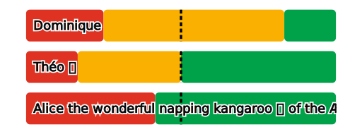

# Merit Profile Generation for Golang

Generate merit profiles (in SVG), for use for example in [Majority Judgment] polls.

[Majority Judgment]: https://mieuxvoter.fr


## Usage

```shell
go get github.com/mieuxvoter/merit-profile-library-go
```

```golang
package main

import (
	"fmt"
	"github.com/mieuxvoter/merit-profile-library-go/merit"
)

func main() {
	proposals := []merit.Proposal{
		{
			Name:  "Alice the wonderful napping kangaroo 🦘 of the Æther",
			Tally: []uint64{4, 0, 3, 7},
		},
		{
			Name:  "Dominique",
			Tally: []uint64{5, 6, 1, 2},
		},
		{
			Name:  "Théo 🗳",
			Tally: []uint64{3, 3, 2, 6},
		},
	}

	svg, err := merit.RenderLinearProfileSVG(proposals)

	if err != nil {
		panic(err)
	}

	fmt.Print(svg)
}
```

> [!WARNING]
> Make sure your tallies are:
> - **Consistent**: Their shape must be the same.
> - **Balanced**: Their total must be the same.




## Options

There are options you can pass to `RenderLinearProfileSVG()` to customize the output.

Here's an example:

```golang
svg, err := merit.RenderLinearProfileSVG(
	proposals,
	merit.WithWidth(1024),
	merit.WithHeight(2048),
	merit.WithPadding(32),
	merit.WithVerticalSpacing(32),
	merit.WithBgColor(color.RGBA{R: 0, G: 0, B: 0, A:255}),
	merit.WithMedianLineColor(color.RGBA{R: 0, G: 0, B: 255, A:255}),
	merit.WithTextColor(color.RGBA{R: 255, G: 0, B: 255, A:255}),
	merit.WithOutlineColor(color.RGBA{R: 0, G: 255, B: 255, A:255}),
	//merit.WithGradesPalette(…),
)
```

## Development Goodies

> Unit-testing on SVG generation is clunky at best, and not really worth it.

Therefore, we used a custom flavor of `svgplay` for convenience.

    go run svgplay.go

Visit http://localhost:1999/test.go

